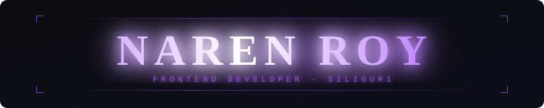

<p align="center">
  
</p>

# Naren Roy — Portfolio Website

A personal portfolio website built with [Next.js](https://nextjs.org), showcasing my projects, skills, and experience as a Frontend Developer.

## 🚀 Live Demo

> Live Link : https://www.narenroy.in / 

## 🛠️ Tech Stack

- **Framework:** Next.js 15 (App Router)
- **Language:** TypeScript
- **Styling:** Tailwind CSS
- **Animations:** GSAP
- **Deployment:** Vercel

## 📦 Getting Started

Clone the repository:

```bash
git clone https://github.com/CyberSparkx/portfolio.git
cd portfolio
```

Install dependencies and run the development server:

```bash
npm install
npm run dev
```

Open [http://localhost:3000](http://localhost:3000) in your browser to see the result.


## ✨ Features

- Responsive design for all screen sizes
- GSAP-powered scroll animations
- Project showcase section
- Skills & experience overview
- Contact section

## 🔗 Connect

- **GitHub:** [github.com/CyberSparkx](https://github.com/CyberSparkx)
- **LinkedIn:** [linkedin.com/in/naren-roy-4390a6238](https://linkedin.com/in/naren-roy-4390a6238/)
- **Instagram:** [@iamnarenroy](https://instagram.com/iamnarenroy/)
- **Twitter / X:** [@NarenRo26790356](https://x.com/NarenRo26790356)

